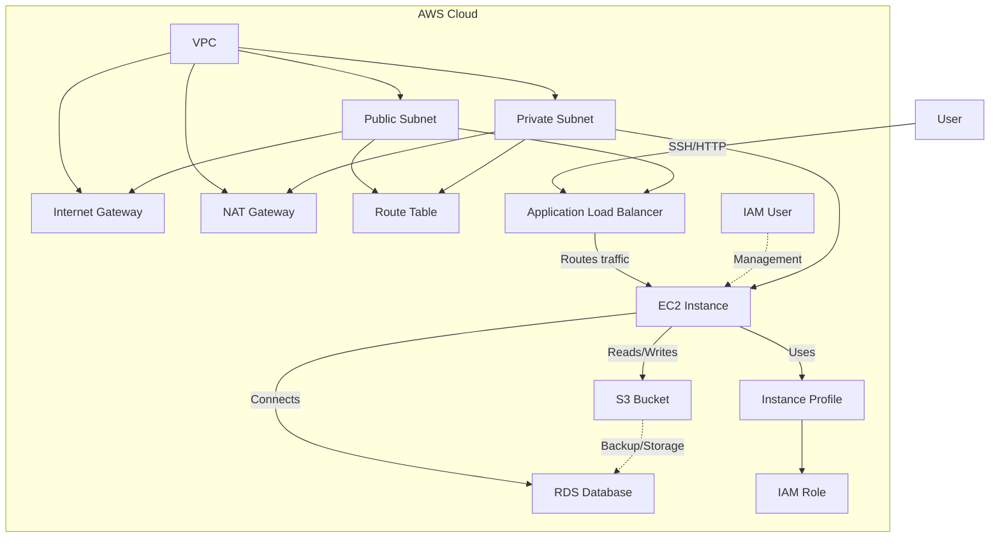

# Infrastructure as Code (IaC) with Terraform on AWS

## Overview
This project demonstrates best practices in Infrastructure as Code (IaC) using [Terraform](https://www.terraform.io/) to provision and manage AWS cloud infrastructure. It showcases automated provisioning, configuration management, version control, and security integration for scalable and reliable cloud environments.

## Architecture Diagram
Below is a high-level AWS architecture diagram representing the resources and their relationships provisioned by this project:



## Features
- **Automated Provisioning:** Deploy AWS resources (VPC, EC2, IAM) using modular Terraform code.
- **Version Control:** Manage infrastructure state and configuration with Git for collaboration and change tracking.
- **Security Best Practices:** Integrate identity management, secure networking, and compliance standards directly into IaC scripts.
- **Modular Design:** Reusable modules for VPC, EC2, and IAM to promote maintainability and scalability.

## Project Structure
```
IAC-using-Terraform/
│
├── main.tf
├── variables.tf
├── outputs.tf
├── providers.tf
├── versions.tf
├── README.md
├── .gitignore
└── modules/
    ├── vpc/
    │   ├── main.tf
    │   ├── variables.tf
    │   └── outputs.tf
    ├── ec2/
    │   ├── main.tf
    │   ├── variables.tf
    │   └── outputs.tf
    └── iam/
        ├── main.tf
        ├── variables.tf
        └── outputs.tf
```

## Prerequisites
- [Terraform](https://www.terraform.io/downloads.html) >= 1.0.0
- [AWS CLI](https://aws.amazon.com/cli/) configured with appropriate credentials
- An AWS account with permissions to create VPC, EC2, and IAM resources

## Setup & Usage
1. **Clone the repository:**
   ```bash
   git clone https://github.com/AmanChowdary/IAC-using-Terraform.git
   cd IAC-using-Terraform
   ```
2. **Initialize Terraform:**
   ```bash
   terraform init
   ```
3. **Customize Variables:**
   Edit `variables.tf` or provide a `terraform.tfvars` file to override defaults.
4. **Plan the Deployment:**
   ```bash
   terraform plan
   ```
5. **Apply the Configuration:**
   ```bash
   terraform apply
   ```
6. **Destroy Resources (when done):**
   ```bash
   terraform destroy
   ```

## Module Overview
- **VPC Module:** Provisions a secure, isolated Virtual Private Cloud with public/private subnets.
- **EC2 Module:** Deploys EC2 instances with security groups and IAM roles.
- **IAM Module:** Manages IAM users, roles, and policies for secure access control.

## Security & Compliance
- Follows AWS security best practices for networking, identity, and access management.
- Infrastructure changes are tracked and auditable via Git version control.

## Contributing
Contributions are welcome! Please open issues or pull requests for improvements or suggestions. All code is automatically checked for formatting and validated using GitHub Actions.

## Contact
For questions, feedback, or collaboration, connect with me on [LinkedIn](https://www.linkedin.com/in/amanchowdary/) or open an issue in this repository.
